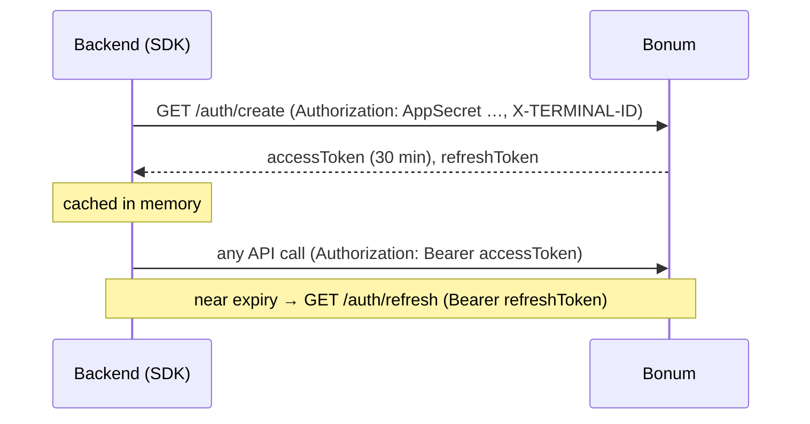
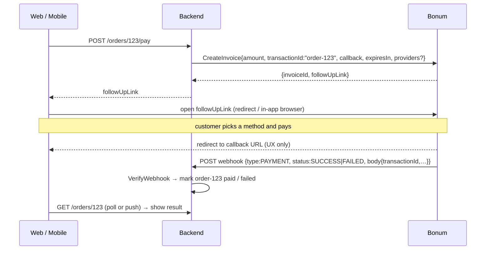
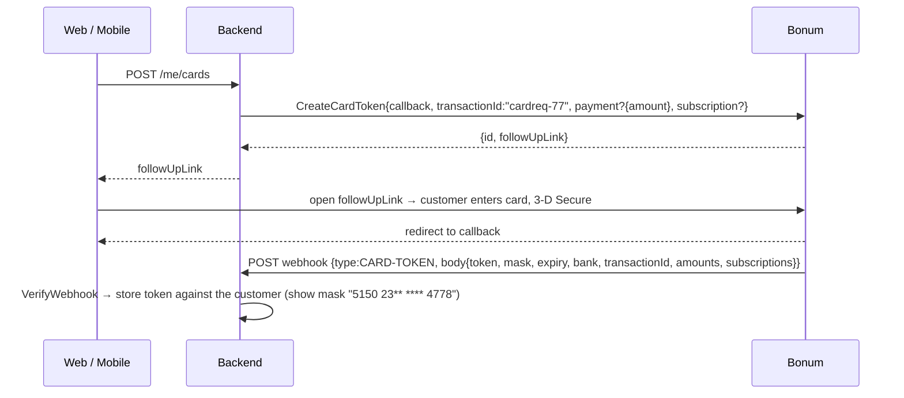
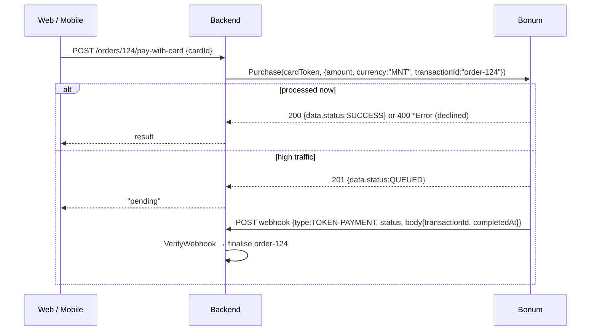
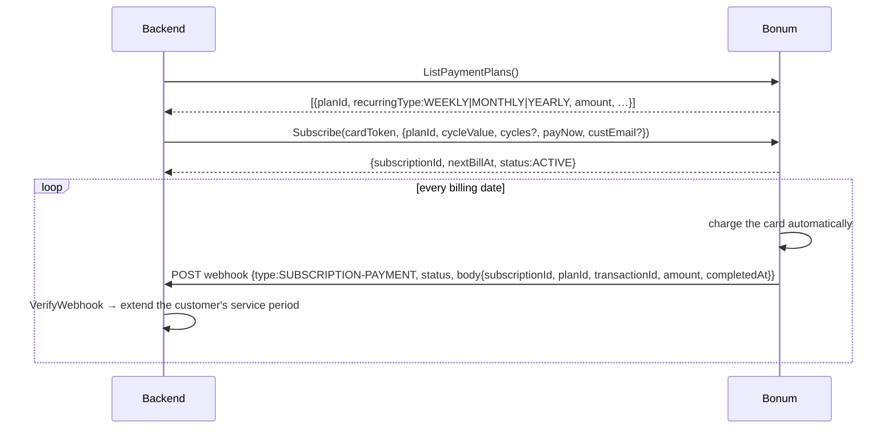
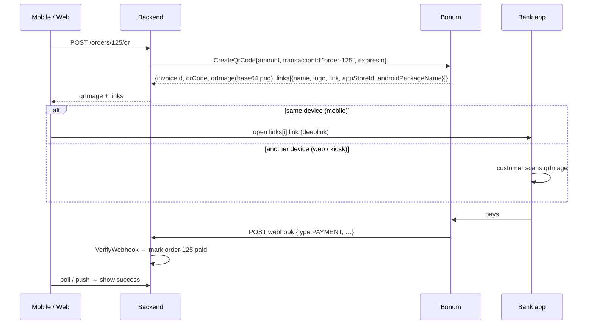
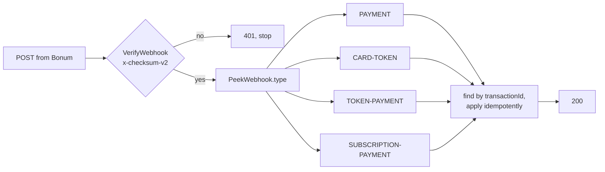

# Bonum integration flow — backend, web, mobile

Bonum (`psp.bonum.mn`) is a **server-to-server** gateway. Only your backend talks to Bonum.
Web and mobile clients talk to *your* backend and are handed a Bonum-hosted link, a QR image,
or bank deeplinks. Secrets (`APP_SECRET`, `MERCHANT_CHECKSUM_KEY`, bearer tokens) never leave the
backend. This SDK is the backend piece.

```
 web / mobile ──── your API ────► your backend ──── bonum-go ────► Bonum
      ▲                              ▲                                   │
      │  followUpLink / qrImage      │  webhook (x-checksum-v2)          │
      └──────────────────────────────┴───────────────────────────────────┘
```

Two rules underpin everything below:

1. **The webhook is the source of truth.** The browser `callback` redirect only tells you the
   customer came back; it does not prove they paid.
2. **Verify every webhook** with `bonum.VerifyWebhook(rawBody, header, MERCHANT_CHECKSUM_KEY)`
   before acting on it. Then look up the order by `transactionId` (your id) and update it
   idempotently — Bonum may retry deliveries.

---

## 0. Authentication (automatic)



`auth/create` is rate limited (429 if hammered). The SDK fetches once, reuses, and refreshes
before expiry; you never pass tokens around. Create one `bonum.Client` per process/terminal.

---

## 1. Checkout payment (web or mobile)

Use this for one-off purchases. The customer pays on Bonum's page with QPay, card, WeChat,
SonoShop… whatever the terminal has enabled (`GetPaymentProviders`).



**Web:** `window.location = followUpLink` (or a new tab). Make `callback` a page in your app
that shows "checking your payment…" and reads the order status from your backend.

**Mobile:** open `followUpLink` in an in-app browser (SFSafariViewController / Chrome Custom Tabs).
Set `callback` to a URL your app intercepts (universal link / app link) so it returns to the app
and then fetches the order status. For a fully native feel use the QR flow (§4).

Webhook payloads:

- `SUCCESS` body: `amount, currency, completedAt, terminalId, invoiceId, paymentVendor,
  initType, status:"PAID", respCode, transactionId, extras`
- `FAILED` body: `transactionId, amount, currency, updatedAt, terminalId, invoiceStatus:"EXPIRED"…`

Do **not** poll `GetInvoiceStatusSandbox` in production — Bonum blocks it. Keep an invoice table
on your side and let the webhook update it.

---

## 2. Save a card (tokenization)

Needed for one-click repeat purchases and subscriptions. The card details are entered on
Bonum's page; you only ever receive an opaque token.



- `payment.amount` charges the card during tokenization (default 0.01 MNT verification charge).
- `subscription{planId, cycleValue, cycles?, payNow, custEmail?}` enrols the new card into a plan
  in the same step; the webhook's `subscriptions[]` then carries the `subscriptionId`.

---

## 3. Charge a saved card

### One-off (`Purchase`)



`RollbackPurchase(cardToken, transactionId)` reverses a purchase. The card token goes in the
`X-CARD-TOKEN` header; the SDK does that for you.

### Recurring (`Subscribe`)



- `cycleValue`: 1–7 (Mon–Sun) weekly, 1–31 monthly, 1–366 yearly. Ignored when `payNow`.
- If the subscription day equals today's `cycleValue`, the first charge runs immediately.
- Change card: `ChangeSubscriptionTokenExisting(id, otherToken)` or
  `ChangeSubscriptionTokenNew(id, …)` (returns a `followUpLink`, same as §2).
- Stop: `Unsubscribe` (already scheduled charge still runs) vs `DeleteSubscription` (stops now).
- Sandbox: `ExecuteSubscriptionPaymentSandbox(id)` fires a billing run so you can test the webhook.

Plans are created on the merchant portal, not through the API.

---

## 4. QR / deeplink payment (mobile-native, kiosk, POS)

Use when you want to show a QR the customer scans with any bank app, or offer
"Pay with Khan Bank / SocialPay…" buttons that deep-link straight into that app.



- On mobile, render `links[]` as buttons; `androidPackageName` / `appStoreId` let you hide apps
  that are not installed or fall back to the store.
- `InvoiceByQrCode(qrCode)` resolves a scanned QPay string back to its invoice.
- `PayByCardToken(cardToken, {qrCode, transactionId})` settles a QR invoice with a saved card —
  useful when *your* app is the one scanning a merchant's QR.

---

## 5. Webhook endpoint checklist



- Register the URL with Bonum (merchant portal / support) — it is not set per request.
- Reply `200` quickly; do heavy work asynchronously.
- Ignore `message` — Bonum says its text may change at any time.
- Store `traceId`s from API errors; Bonum support asks for them.

---

## Endpoint ↔ SDK map

| Step | Bonum endpoint | SDK |
|---|---|---|
| token | `GET /bonum-gateway/ecommerce/auth/create`, `/auth/refresh` | automatic |
| providers | `GET …/invoices/payment-providers` | `GetPaymentProviders` |
| checkout | `POST …/invoices` | `CreateInvoice` |
| save card | `POST /mpay-service/merchant/cards/tokenize/request` | `CreateCardToken` |
| charge token | `POST …/transaction/purchase` | `Purchase` |
| reverse | `DELETE …/transaction/reverse/{transactionId}` | `RollbackPurchase` |
| plans | `GET …/values/payment-plans` | `ListPaymentPlans` |
| subscribe | `POST …/subscriptions/subscribe` | `Subscribe` |
| list subs | `GET …/subscriptions` | `GetSubscriptions` |
| change card | `PUT …/subscriptions/{id}/change[/create-new-token]` | `ChangeSubscriptionToken*` |
| cancel | `DELETE …/subscriptions/{id}[/delete]` | `Unsubscribe`, `DeleteSubscription` |
| QR | `POST …/transaction/qr/create`, `/qr`, `PUT …/qr/pay` | `CreateQrCode`, `InvoiceByQrCode`, `PayByCardToken` |
| webhook | merchant URL, header `x-checksum-v2` | `VerifyWebhook`, `Parse*Webhook` |
