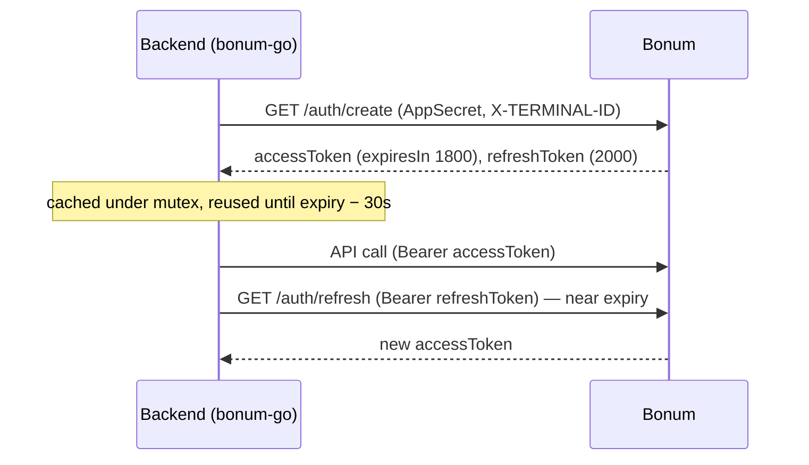
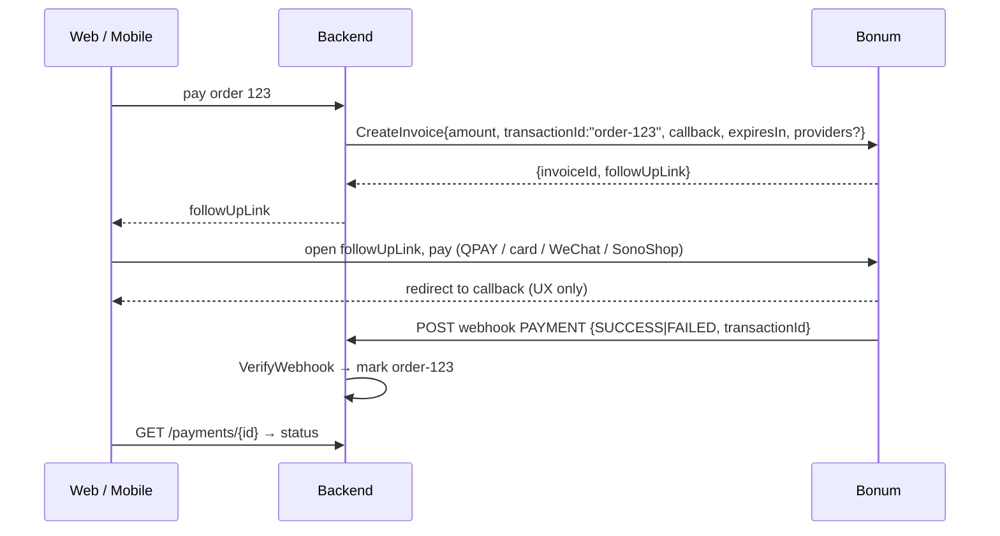
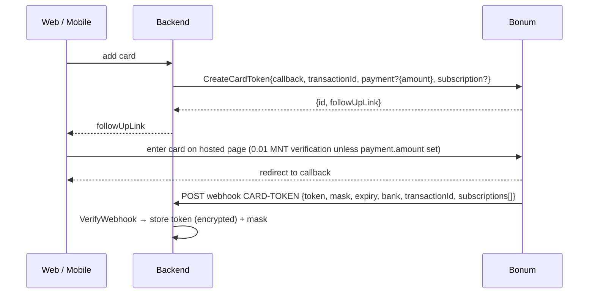
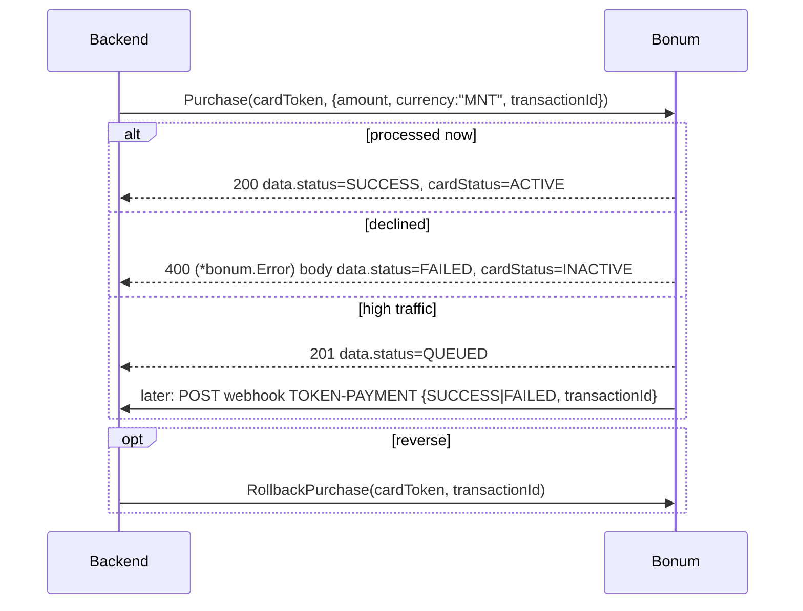
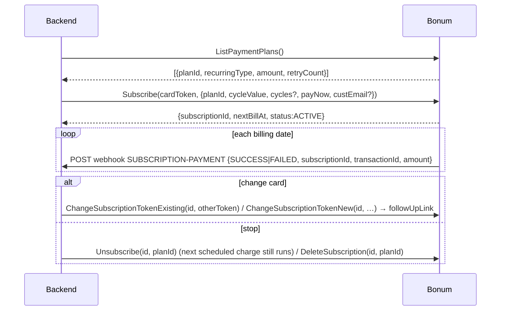
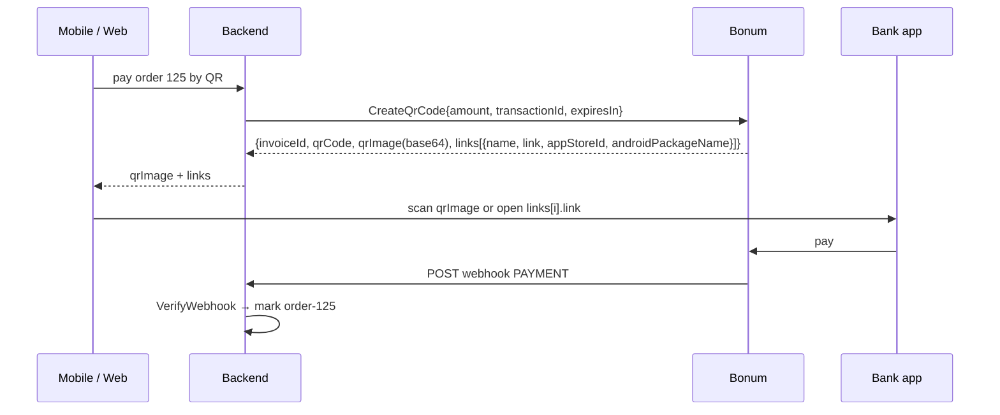
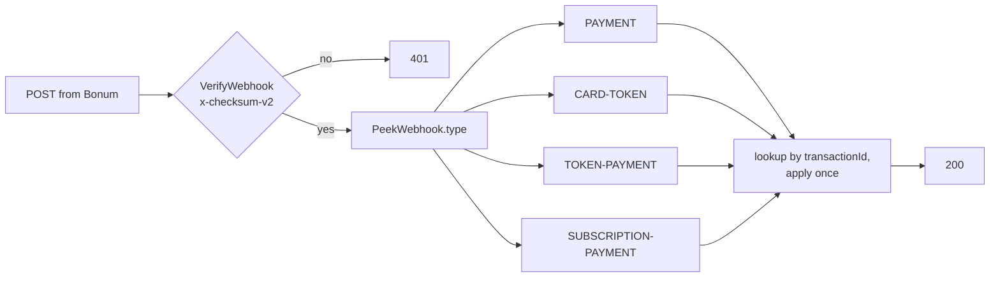
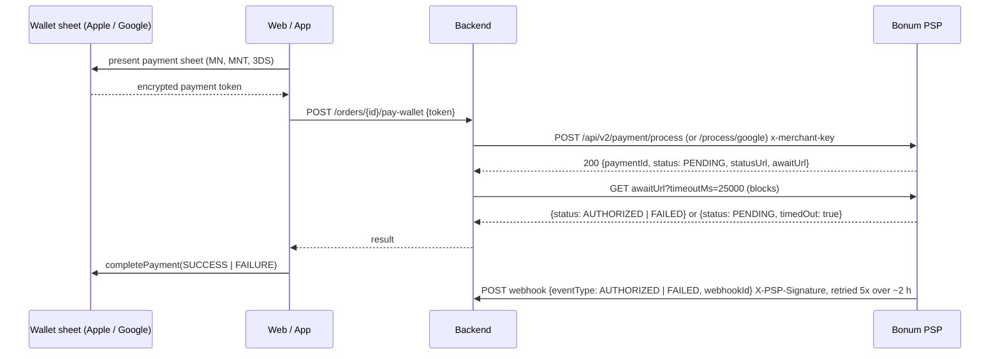

# Bonum Gateway SDK — Integration Report

Date: 2026-09-07 · Repo: https://github.com/techpartners-asia/bonum-go @ `35c56ee`

Citation keys: `[C: …]` = Postman collection item, `[W: …]` = page on https://psp.bonum.mn, `[S: …]` = SDK source file. Full list in [Sources](#sources).

## 1. Summary

`bonum-go` is a backend-only Go client for the Bonum Gateway APIs, module `github.com/techpartners-asia/bonum-go` [S: go.mod]. It wraps authentication, checkout invoices, card tokenization, token purchases, subscription plans, QR/deeplink payments, and webhook verification/parsing [S: client.go, invoice.go, cardtoken.go, subscription.go, qr.go, webhook.go].

- **Implemented:** every collection item that has a URL under `{{API_BASE_URL}}` (20 calls) plus parsers for all four webhook message types [C: all folders; S: *.go].
- **Tested offline:** 16 unit tests — HMAC vector cross-checked with `openssl`, four webhook payload parsers, and an `httptest` fake gateway exercising token caching/refresh, headers, DELETE body, path params and error decoding [S: webhook_test.go, client_test.go].
- **Not yet verified against Bonum:** no request has been sent to `testapi.bonum.mn`; two URL ambiguities and seven response shapes remain open (§7).
- **Out of scope:** Neo App chat endpoints, the "Request a card token" item (no URL), and Bonum's separate V2 Apple Pay / Google Pay API (§3, §7; how to use it is documented in §11).

## 2. Environments & auth

| | Host | Source |
|---|---|---|
| Sandbox (`types.Sandbox`) | `https://testapi.bonum.mn` | [C: collection description] [S: types/common.go] |
| Production (`types.Production`) | `https://apis.bonum.mn` | [C: collection description] [S: types/common.go] |

- Token creation: `GET /bonum-gateway/ecommerce/auth/create` with headers `Authorization: AppSecret {APP_SECRET}` and `X-TERMINAL-ID: {DEFAULT_TERMINAL_ID}`; both values come from the merchant portal [C: Authentication › Get token].
- Success body: `tokenType: "Bearer"`, `accessToken`, `expiresIn: 1800`, `refreshToken`, `refreshExpiresIn: 2000`, `unit: "SECONDS"` [C: Authentication › Get token › "Get token Success" 200].
- Rate limit: excessive calls return `TOO_MANY_REQUESTS`; the 429 example says "Rate-Limit: Use previous token. Do not get token too frequently" [C: Authentication › Get token (description, 429 example)].
- Refresh: `GET /bonum-gateway/ecommerce/auth/refresh` with `Authorization: Bearer {refreshToken}`; the item has no example response, and its Postman test script only asserts that `accessToken` is present [C: Authentication › Refresh token (auth, test script)].
- Every other call inherits collection-level `Bearer {{accessToken}}` [C: collection `auth`]. `Accept-Language: mn | en` localises messages [C: collection description].

SDK behaviour [S: auth.go, client.go]:

- `Client.token()` runs under a `sync.Mutex`; it reuses the cached access token while `now < accessExpiresAt − 30s`, otherwise tries `auth/refresh` if the refresh token is still valid (same 30 s skew), otherwise calls `auth/create` (`tokenExpirySkew = 30 * time.Second`).
- `auth/refresh` may omit the refresh token; the SDK keeps the previous one in that case (`storeTokensLocked`).
- `Authenticate()` / `Refresh()` force either step. Defaults: 30 s HTTP timeout, `Accept-Language: mn`, DELETE payloads enabled; options `WithLanguage`, `WithBaseURL`, `WithTimeout`.

## 3. Coverage matrix

"Example" = the collection item carries at least one saved response body. "Type" = how the SDK types the response: **exact** (mirrors an example), **inferred** (shape borrowed from a sibling call, marked in `types/`), **raw** (`json.RawMessage`).

| Folder › item | Method + path (collection) | SDK | Example | Type |
|---|---|---|---|---|
| Authentication › Get token | `GET /bonum-gateway/ecommerce/auth/create` | automatic; `Authenticate()` | yes (200, 429) | exact |
| Authentication › Refresh token | `GET /bonum-gateway/ecommerce/auth/refresh` | automatic; `Refresh()` | no | inferred (= create) |
| Web payment › Get Payment Providers | `GET …/ecommerce/invoices/payment-providers` | `GetPaymentProviders` | yes | exact |
| Web payment › Create Invoice | `POST …/ecommerce/invoices` | `CreateInvoice` | yes | exact |
| Web payment › Get Invoice Status (Testing) | `GET …/ecommerce/invoices/{invoiceId}` | `GetInvoiceStatusSandbox` | no | raw |
| Web payment › Set Invoice To Paid Status (Testing) | `GET …/ecommerce/invoices/paid?invoiceId=` | `SetInvoicePaidSandbox` | no | raw |
| Web payment › WebHook - Create Invoice | (doc only, no URL) | `ParsePaymentWebhook` | yes (success, failed) | exact |
| Card Tokenization › Create Card Token | `POST /mpay-service/merchant/cards/tokenize/request` | `CreateCardToken` | yes (×2) | exact |
| Card Tokenization › Create Card Token Web Hook Message | (doc only, no URL) | `ParseCardTokenWebhook` | body in description | exact |
| Card Tokenization › Purchase | `POST …/merchant/transaction/purchase` (`X-CARD-TOKEN`) | `Purchase` | yes (200, 400, 201 queued) | exact |
| Card Tokenization › Purchase Async WebHook | (doc only, no URL) | `ParseTokenPaymentWebhook` | body in description | exact |
| Card Tokenization › Rollback Purchase | `DELETE …/merchant/transaction/reverse/:transactionId` (`X-CARD-TOKEN`) | `RollbackPurchase` | no | raw — **path disputed, §7.1** |
| Subscription plans › List Of Payment Plans | `GET …/merchant/values/payment-plans` | `ListPaymentPlans` | yes | exact |
| Subscription plans › Subscribe | `POST …/merchant/subscriptions/subscribe` (`X-CARD-TOKEN`) | `Subscribe` | yes (200, 400, 429) | exact |
| Subscription plans › Change Subscription Token (Create New Token) | `PUT …/merchant/subscriptions/:subscriptionId/change/create-new-token` | `ChangeSubscriptionTokenNew` | no | inferred (= Create Card Token) |
| Subscription plans › Change Subscription Token (Existing Token) | `PUT …/merchant/subscriptions/:subscriptionId/change` (`X-CARD-TOKEN`) | `ChangeSubscriptionTokenExisting` | no | inferred (= Subscribe) |
| Subscription plans › Get Subscriptions | `GET …/merchant/subscriptions` (`X-CARD-TOKEN`) | `GetSubscriptions` | no | inferred (`[]Subscription`) |
| Subscription plans › Unsubscribe | `DELETE …/merchant/subscriptions/:subscriptionId` body `{planId}` | `Unsubscribe` | no | raw |
| Subscription plans › Delete Subscription | `DELETE …/merchant/subscriptions/:subscriptionId/delete` body `{planId}` | `DeleteSubscription` | no | raw |
| Subscription plans › Request a card token | **no URL in collection** | — not implementable | no | — |
| Subscription plans › Subscription Automatic Payment WebHook Messages | (doc only, no URL) | `ParseSubscriptionPaymentWebhook` | body in description | exact |
| Subscription plans › [TEST] Execute A Subscription Payment | `PUT …/merchant/subscriptions/:subscriptionId/execute` | `ExecuteSubscriptionPaymentSandbox` | no | raw |
| QR › Create Qr Code | `POST …/merchant/transaction/qr/create` | `CreateQrCode` | yes | exact |
| QR › Invoice By Qr Code | `POST …/merchant/transaction/qr` | `InvoiceByQrCode` | no | inferred (= Create Qr Code) |
| QR › Pay By Card Token | `PUT {{TOKEN_BASE_URL}}/merchant/transaction/qr/pay` (`X-CARD-TOKEN`) | `PayByCardToken` | no | inferred (= Purchase) — **host undefined, §7.2** |
| Neo App › Purchase | **no URL** (description only) | skipped | no | — |
| Neo App › Get User Data | `GET {{M_CHAT_BASE_URL}}/users/apps/share/requests` | skipped (host undefined) | no | — |
| Neo App › Send Chat Message to Neo User | `POST {{NEO_BASE_URL}}/messages/send` | skipped (host undefined) | no | — |
| WebHook delivery › 5 items | (doc only) | `Checksum`, `VerifyWebhook`, `PeekWebhook` | checksum code in description | — |

Sources: paths, methods, headers and example presence re-parsed from the collection JSON [C: all items]; SDK paths from [S: auth.go, invoice.go, cardtoken.go, subscription.go, qr.go]; type markers from [S: types/cardtoken.go, types/subscription.go, types/qr.go].

Notes from the examples: the `Create Qr Code` example JSON is missing a comma after `traceId` [C: QR › Create Qr Code example]; the `Subscribe` 200 example carries `"status": 201` in its body [C: Subscription plans › Subscribe › "Subscribe"]; `Purchase` says not to rely on or expose `errorCode` [C: Card Tokenization › Purchase (description)].

## 4. Webhooks

Bonum POSTs to the webhook URL registered in the merchant portal; the URL is not passed per request [C: Web payment › Create Invoice (description)]. Verification: `x-checksum-v2` header = hex(HMAC-SHA256(key = `MERCHANT_CHECKSUM_KEY`, message = the JSON body serialised without indentation)) [C: WebHook delivery › WebHook Checksum [EN]]. The SDK hashes the raw bytes as received and compares in constant time (`hmac.Equal`) [S: webhook.go].

| `type` | `status` | Key `body` fields | Source | SDK |
|---|---|---|---|---|
| `PAYMENT` | `SUCCESS` | `amount, currency, completedAt, terminalId, invoiceId, paymentVendor, initType, status:"PAID", respCode, transactionId, extras-inputs, extras` | [C: Web payment › WebHook - Create Invoice (Successful)] | `ParsePaymentWebhook` |
| `PAYMENT` | `FAILED` | `transactionId, amount, currency, updatedAt (epoch ms), terminalId, invoiceStatus:"EXPIRED"` | [C: Web payment › WebHook - Create Invoice (Failed)] | `ParsePaymentWebhook` |
| `CARD-TOKEN` | `SUCCESS` | `token, mask, expiry, bank{id,code,name,icon,iBanCode,transferCode}, transactionId, completedAt, amounts[], subscriptions[{subscriptionId,planId,nextBillingDate}]` | [C: Card Tokenization › Create Card Token Web Hook Message] | `ParseCardTokenWebhook` |
| `TOKEN-PAYMENT` | `SUCCESS \| FAILED` | `transactionId, completedAt` | [C: Card Tokenization › Purchase Async WebHook] | `ParseTokenPaymentWebhook` |
| `SUBSCRIPTION-PAYMENT` | `SUCCESS \| FAILED` | `subscriptionId, invoiceId, planId, transactionId, completedAt, amount, currency` | [C: Subscription plans › Subscription Automatic Payment WebHook Messages] | `ParseSubscriptionPaymentWebhook` |

- `message` is free text that "could be changed anytime, DO NOT RELY ON ITS VALUE" [C: WebHook delivery › WebHook receive [EN]].
- No `CARD-TOKEN` / `PAYMENT` failure-variant body for tokenization is shown; the collection's "Failure" examples for Card Tokenization have empty bodies [C: WebHook delivery › Webhook Messages (examples)].
- Idempotency: the payloads carry no event id, so dedupe on `(type, transactionId)` and make state transitions one-way (`PENDING → PAID` applies once). `PeekWebhook` decodes only `type/status/message` for dispatch [S: webhook.go].

## 5. Flow diagrams

Long-form narrative with per-platform notes: [FLOW.md](../FLOW.md).

### (a) Token lifecycle

### (b) Checkout invoice — web / mobile

### (c) Card tokenization

### (d) Purchase with token, incl. QUEUED

### (e) Subscription lifecycle

### (f) QR / deeplink

### (g) Webhook handler

## 6. Card validity question

Finding: **no card validation, verification, BIN or card-lookup endpoint exists** on any page of psp.bonum.mn. Pages checked: `/` (Apple Pay guide) [W: /], `/google-pay/index.html` [W: google-pay], `/online-merchant-guide.html` [W: online-merchant-guide], `/bonum-gateway-apis.html` [W: bonum-gateway-apis], `/v2/integration-guide.html`, `/v2/api-reference.html`, `/v2/webhook-guide.html`, `/v2/migration-guide.html` [W: v2/*]. The API reference lists no such endpoint and shows `cardStatus` only inside `Purchase` responses [W: bonum-gateway-apis.html#card-tokenization].

What exists instead:

- Tokenization charges the card: "if no payment.amount is passed, **0.01 MNT** will be processed for verification" [C: Card Tokenization › Create Card Token (description)]; the outcome arrives as the `CARD-TOKEN` webhook.
- A `Purchase` response reports `cardStatus: "ACTIVE"` on success (200) and `"INACTIVE"` on the 400 decline example [C: Card Tokenization › Purchase examples]; possible values are not enumerated anywhere [W: bonum-gateway-apis.html#card-tokenization].
- Card data is entered only on Bonum's hosted page ("The URL contains a form where the customer inputs and verifies their card details") [W: online-merchant-guide.html › Card Linking], so arbitrary card numbers cannot be submitted or checked by the merchant.

## 7. Discrepancies & open questions

| # | Item | Collection | Website | SDK today | How to settle |
|---|---|---|---|---|---|
| 1 | Rollback path | `DELETE /mpay-service/merchant/transaction/reverse/:transactionId` [C: Card Tokenization › Rollback Purchase] | `DELETE /mpay-service/merchant/transaction/rollback/{id}` [W: bonum-gateway-apis.html#card-tokenization] | `…/transaction/reverse/{transactionId}` [S: cardtoken.go] | call both on sandbox with a fake id; 404 vs validation error |
| 2 | Pay-by-token host | `PUT {{TOKEN_BASE_URL}}/merchant/transaction/qr/pay`; `TOKEN_BASE_URL` is never defined [C: QR › Pay By Card Token; collection description] | `PUT /merchant/transaction/qr/pay` [W: bonum-gateway-apis.html] | `{API_BASE_URL}/mpay-service/merchant/transaction/qr/pay` — an assumption [S: qr.go] | sandbox call; ask Bonum for `TOKEN_BASE_URL` |
| 3 | Inferred / raw response shapes | no examples for `RollbackPurchase`, `Unsubscribe`, `DeleteSubscription`, `GetSubscriptions`, `InvoiceByQrCode`, `PayByCardToken`, `ChangeSubscriptionToken*` [C: those items] | — | marked in `types/` [S: types/cardtoken.go, types/subscription.go, types/qr.go] | capture sandbox bodies, tighten types |
| 4 | Refresh response | no example; test script checks `accessToken` only [C: Authentication › Refresh token] | example shows the same fields as create [W: bonum-gateway-apis.html#authentication] | decoded as `AuthResponse`; missing `refreshToken` keeps the old one [S: auth.go] | confirm on sandbox |
| 5 | V2 wallet API | not in collection | `POST /api/v2/payment/process`, `POST /api/v2/payment/process/google`, `GET /api/v2/payments/{paymentId}`, `…/{paymentId}/await`, `…/lookup/by-order-id`; webhook signed `X-PSP-Signature` (HMAC-SHA256 over `"${timestamp}.${rawBody}"`, `v1=` prefix, `X-PSP-Timestamp` ≤ 5 min), events `AUTHORIZED`/`FAILED` with `webhookId` [W: v2/api-reference, v2/webhook-guide] | not covered | see §11; a separate `wallet` package if Apple Pay / Google Pay is wanted |
| 6 | "Request a card token" | item has no URL [C: Subscription plans › Request a card token] | not documented | not implemented | ask Bonum for the path |

## 8. Test evidence

`go test ./...` passes (16 tests, no network) [S: webhook_test.go, client_test.go].

| File | Test | Verifies |
|---|---|---|
| webhook_test.go | `TestChecksumMatchesOpenSSL` | HMAC-SHA256 hex equals a vector computed with `openssl dgst -sha256 -hmac` |
| | `TestVerifyWebhook` | accepts valid header; rejects wrong key, tampered body, empty header |
| | `TestPeekWebhook` | envelope `type`/`status` decoding |
| | `TestParsePaymentWebhookSuccess`, `TestParsePaymentWebhookFailed` | both PAYMENT payload variants from the collection |
| | `TestParseCardTokenWebhook`, `TestParseSubscriptionPaymentWebhook` | CARD-TOKEN and SUBSCRIPTION-PAYMENT payloads |
| | `TestParseWebhookRejectsWrongType` | type mismatch is an error |
| client_test.go | `TestTokenIsFetchedOnceAndReused` | `auth/create` called once across three calls; `Accept-Language` sent |
| | `TestExpiredAccessTokenIsRefreshed` | expired access token → `auth/refresh` once, new bearer used, no second `auth/create` |
| | `TestCreateInvoiceSendsBody` | JSON body fields; empty optional arrays omitted |
| | `TestPurchaseSendsCardTokenHeader` | `X-CARD-TOKEN` header; envelope decoding |
| | `TestNon2xxBecomesError` | 400 → `*bonum.Error{StatusCode, TraceID, Message}` |
| | `TestDeleteWithPathParamAndBody` | DELETE with path param and `{planId}` body |
| | `TestPutWithPathParam` | PUT path substitution |
| | `TestSandboxQueryParam` | `invoiceId` query forwarded |

Not covered by tests: any real Bonum response, the disputed paths in §7, and the `tests/main.go` smoke program (needs `BONUM_APP_SECRET` / `BONUM_TERMINAL_ID`) [S: tests/main.go].

## 9. Recommended backend endpoints

Split by audience; clients reference your ids only (order id, saved-card id), never amounts or tokens.

| Audience | Method | Path | SDK call |
|---|---|---|---|
| customer | GET | `/payment-providers` | `GetPaymentProviders` |
| customer | POST | `/orders/{orderId}/payments` `{method: CHECKOUT\|QR\|SAVED_CARD, cardId?, providers?}` | `CreateInvoice` / `CreateQrCode` / `Purchase` |
| customer | GET | `/payments/{paymentId}` | — (own DB) |
| customer | POST | `/cards` | `CreateCardToken` |
| customer | GET | `/cards/enrollments/{id}`, `/cards` | — (own DB) |
| customer | DELETE | `/cards/{cardId}` | `Unsubscribe` for linked subscriptions |
| customer | GET | `/plans` | `ListPaymentPlans` |
| customer | POST / GET | `/subscriptions` | `Subscribe` / own DB |
| customer | PUT | `/subscriptions/{id}/card` `{cardId}` or `{newCard:true}` | `ChangeSubscriptionTokenExisting` / `…New` |
| customer | DELETE | `/subscriptions/{id}` (`?immediate=true`) | `Unsubscribe` / `DeleteSubscription` |
| webhook | POST | `/webhook/bonum` | `VerifyWebhook`, `PeekWebhook`, `Parse*Webhook` |
| admin | GET | `/payments`, `/subscriptions` | — |
| admin | POST | `/payments/{id}/reverse` | `RollbackPurchase` |
| admin (non-prod) | POST | `/sandbox/payments/{id}/mark-paid` | `SetInvoicePaidSandbox` |

Rules: amount is derived from the order server-side; the card token is looked up by `cardId` + authenticated user and never returned to clients; the webhook handler verifies the checksum on the raw body, dedupes on `(type, transactionId)`, returns 200 quickly; one `bonum.Client` per process (it caches the bearer token); the browser `callback` URL is a frontend route that polls `/payments/{id}`, not a status source. `GetInvoiceStatusSandbox` must not be used in production [C: Web payment › Get Invoice Status (Testing)].

## 10. Next steps

1. Run `tests/main.go` against `https://testapi.bonum.mn` using the sandbox `APP_SECRET` and terminal `17171119` published in the collection description [C: collection description]: providers → create invoice → plans → create card token → create QR.
2. Probe §7.1 (`reverse` vs `rollback`) and §7.2 (`TOKEN_BASE_URL`) on the sandbox; ask Bonum support (+976 7200-5000 [W: bonum-gateway-apis.html]) for anything still ambiguous, including §7.6.
3. Replace inferred/raw types in `types/` with the captured sandbox bodies; add the captured bodies to `client_test.go`'s fake.
4. Commit and push to `main`.
5. Optional: a `wallet` package for the V2 Apple Pay / Google Pay API if native wallet buttons are wanted (§11); needs an `x-merchant-key` from Bonum, and an answer on capture/refund (§11.6) before go-live.

## 11. V2 Apple Pay / Google Pay API — how to use it

Bonum runs a second, independent API for wallet payments. It is not in the Postman collection and `bonum-go` does not wrap it; this section is what a `wallet` package would implement.

### 11.1 How it differs from the gateway API

| | Gateway API (`bonum-go`) | V2 wallet API |
|---|---|---|
| Hosts | `testapi.bonum.mn` / `apis.bonum.mn` [C: collection description] | sandbox `testpsp.bonum.mn`, production `psp.bonum.mn` [W: v2/integration-guide] |
| Credential | `AppSecret` + `X-TERMINAL-ID` → bearer token | `x-merchant-key: mk_live_…` on every request, issued at onboarding [W: v2/api-reference, v2/integration-guide] |
| Who enters the card | customer on Bonum's hosted page | Apple / Google wallet sheet inside your web page or app; you forward the encrypted token [W: v2/integration-guide] |
| Result model | synchronous response; webhook for checkout and queued cases | always asynchronous: `PENDING` immediately, final result via `awaitUrl` (≤ 25 s) or webhook [W: v2/integration-guide, v2/migration-guide] |
| Webhook signature | `x-checksum-v2` = hex HMAC-SHA256 of body | `X-PSP-Signature: v1=<hex>` = HMAC-SHA256(secret, `"${timestamp}.${rawBody}"`), `X-PSP-Timestamp` (unix seconds), reject if older than 300 s [W: v2/webhook-guide] |
| Idempotency | none in payload → `(type, transactionId)` | `webhookId` per delivery; a duplicate `order_id` per merchant returns the existing payment [W: v2/webhook-guide, v2/api-reference] |
| Final statuses | `PAID` / `EXPIRED`; `SUCCESS` / `FAILED` | `AUTHORIZED` ("Bank approved the payment. Funds are reserved. Safe to fulfill order.") / `FAILED` [W: v2/api-reference] |

### 11.2 Flow (same for both wallets)

### 11.3 Apple Pay — setup and code [W: / (Apple Pay guide)]

1. Bonum PSP provides the Merchant ID ("Merchant ID-г Bonum PSP-ээс өгсөн байх ёстой"); register it under Identifiers › Merchant IDs in the Apple developer account.
2. **Web:** serve the Bonum-supplied file at `https://yourdomain/.well-known/apple-developer-merchantid-domain-association` with `Content-Type: text/plain`.
3. **App:** Bonum emails a `.csr`; upload it to Apple, create the Apple Pay Payment Processing Certificate, download it and send it back to Bonum for installation.
4. **Web code:** check `ApplePaySession.canMakePayments()`; `new ApplePaySession(3, {countryCode: 'MN', currencyCode: 'MNT', supportedNetworks: ['visa','masterCard','amex'], merchantCapabilities: ['supports3DS'], total})`; in `onvalidatemerchant` POST `{validationURL}` to `https://psp.bonum.mn/api/merchant/validate` and pass the result to `completeMerchantValidation`; in `onpaymentauthorized` send `event.payment.token` + your order id to your backend, then `completePayment(STATUS_SUCCESS | STATUS_FAILURE)` from the backend's answer.
5. **App code:** `PKPaymentRequest` with `merchantIdentifier`, `supportedNetworks [.masterCard, .visa, .amex]`, `merchantCapabilities [.threeDSecure]`, `countryCode "MN"`, `currencyCode "MNT"`; the app sends `token` (`paymentData`, `transactionIdentifier`, `paymentMethod`) plus `order_id` / `branch_id` to your backend.
6. **Backend → Bonum:** `POST /api/v2/payment/process` with `order_id` (≤ 128 chars, required), `amount` (optional, major units, min 0.01, 2 dp, overrides the token amount), `branch_id` (optional, 1–64 chars), `token` = `{paymentData{data, signature, header{publicKeyHash, ephemeralPublicKey, transactionId}, version: "EC_v1"}, paymentMethod{displayName, network, type}, transactionIdentifier}` [W: v2/api-reference].

### 11.4 Google Pay — setup and code [W: google-pay/index.html]

1. Create a business profile in the Google Pay Business Console → obtain your Google Merchant ID → give it to Bonum → receive your merchant key. Bonum's gateway id is the constant `bonumpsp`.
2. **PaymentDataRequest** (`apiVersion 2`): `allowedPaymentMethods: [{type: 'CARD', parameters: {allowedAuthMethods: ['CRYPTOGRAM_3DS'], allowedCardNetworks: ['MASTERCARD','VISA']}, tokenizationSpecification: {type: 'PAYMENT_GATEWAY', parameters: {gateway: 'bonumpsp', gatewayMerchantId: '<your Google Merchant ID>'}}}]`; `merchantInfo: {merchantName, merchantId: 'BCR2DN7TVGEYH4JB'}` on web (omit `merchantId` on Android); `transactionInfo: {totalPriceStatus: 'FINAL', totalPrice, currencyCode: 'MNT'}`; `PaymentsClient({environment: 'TEST' | 'PRODUCTION'})`.
3. Send `paymentData.paymentMethodData.tokenizationData.token` with the order id, amount and currency to your backend.
4. **Backend → Bonum:** `POST /api/v2/payment/process/google` with `order_id`, `token` (required), `currency_code` ∈ `MNT | USD | EUR | JPY` (required), `amount` (optional), `branch_id` (optional) [W: v2/api-reference].
5. **Review:** Business Console › Google Pay API › Add an integration (website or Android app) › integration type "Gateway" › upload 5 screenshots (item selection, pre-purchase, payment method selection, Google Pay sheet, post-purchase) › submit; approval takes 2–3 business days.

### 11.5 Endpoints and getting the result [W: v2/api-reference, v2/integration-guide, v2/webhook-guide]

| Method | Path | Purpose | Notes |
|---|---|---|---|
| POST | `/api/v2/payment/process` | submit an Apple Pay token | returns `{paymentId, orderId, status: PENDING, acceptedAt, statusUrl, awaitUrl}` |
| POST | `/api/v2/payment/process/google` | submit a Google Pay token | same response |
| GET | `/api/v2/payments/{paymentId}/await?timeoutMs=` | block until final status | default 25000 ms, max 28000 "to leave buffer before Apple Pay's 30-second hard limit"; may return `{status: PENDING, timedOut: true}` |
| GET | `/api/v2/payments/{paymentId}` | poll status | `amount` as decimal string, `currency` ISO numeric (`"496"` = MNT), `walletType`, `providerReference`, `failureReason`, `createdAt`, `updatedAt` |
| GET | `/api/v2/payments/lookup/by-order-id?orderId=` | status by your order id | same shape |

- **Recommended for the wallet session:** call `awaitUrl` once from the backend; on `timedOut: true` complete the sheet with FAILURE and rely on the webhook for the final outcome.
- **Webhook:** payload `{webhookId, paymentId, orderId, eventType, status, amount, currency, providerReference, failureReason, occurredAt, walletType: APPLE_PAY | GOOGLE_PAY, binCategory: DOMESTIC | INTERNATIONAL}`; respond 2xx within 10 s; retried 5 times (immediate, ~1 min, ~5 min, ~30 min, ~2 h); store `webhookId` and return 200 for duplicates. The URL and signing secret are registered through Bonum support or the merchant dashboard.
- **Errors:** HTTP status only — 400 (missing `order_id`/`token`, amount < 0.01, bad UUID), 401 (bad `x-merchant-key`), 404 (unknown payment / order), 429 (per-merchant rate limit); no structured error body is documented.

### 11.6 Open questions for Bonum

- `AUTHORIZED` is described as funds reserved, but no capture, void or refund endpoint appears in any V2 page — confirm whether authorization auto-captures and how reversals work before go-live.
- Sandbox credentials (`x-merchant-key` for `testpsp.bonum.mn`) are not published anywhere; request them at onboarding.

### 11.7 Proposed SDK shape

A `wallet` package alongside the gateway client: `ProcessApplePay`, `ProcessGooglePay`, `GetPayment`, `AwaitPayment(timeout)`, `LookupByOrderID`, and `VerifyWebhook(body, signature, timestamp, secret)` implementing the `v1=` HMAC with the 300 s window. Roughly a day of work once a merchant key is available; unit-testable with an `httptest` fake like `client_test.go`.

## Sources

- **[C]** Postman collection: `/Users/strong_b_production/Downloads/Bonum Gateway APIs.postman_collection.json` (collection description, item descriptions, saved example responses, collection-level `auth`, item test scripts).
- **[W]** https://psp.bonum.mn/ · https://psp.bonum.mn/online-merchant-guide.html · https://psp.bonum.mn/bonum-gateway-apis.html · https://psp.bonum.mn/google-pay/index.html · https://psp.bonum.mn/v2/integration-guide.html · https://psp.bonum.mn/v2/api-reference.html · https://psp.bonum.mn/v2/webhook-guide.html · https://psp.bonum.mn/v2/migration-guide.html (fetched 2026-09-04/07).
- **[S]** https://github.com/techpartners-asia/bonum-go @ `35c56ee`: `client.go`, `auth.go`, `invoice.go`, `cardtoken.go`, `subscription.go`, `qr.go`, `webhook.go`, `types/*.go`, `webhook_test.go`, `client_test.go`, `tests/main.go`.
